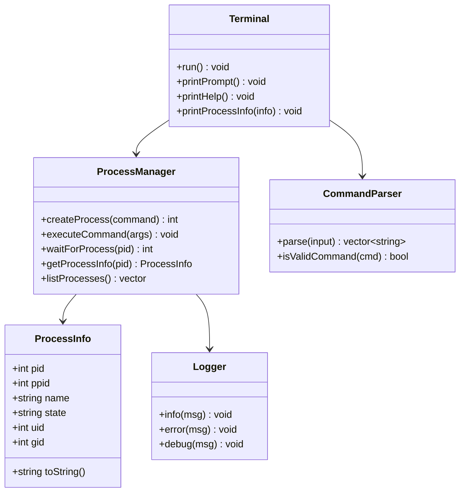

# Linux 进程创建与管理工具 - 项目设计文档

## 1. 系统架构

```mermaid
flowchart TD
    subgraph User["用户交互层"]
        A[终端交互界面]
        B[命令输入]
    end
    
    subgraph Core["核心进程管理层"]
        C[ProcessManager 进程管理器]
        D[fork 创建子进程]
        E[execvp 执行命令]
        F[waitpid 等待进程]
    end
    
    subgraph Info["进程信息层"]
        G[/proc/pid/status 读取]
        H[进程状态解析]
        I[PID/PPID 信息]
    end
    
    subgraph Output["输出层"]
        J[执行结果输出]
        K[进程信息展示]
        L[错误处理提示]
    end
    
    A --> B
    B --> C
    C --> D
    D --> E
    D --> F
    C --> G
    G --> H
    H --> I
    E --> J
    F --> J
    I --> K
    C --> L
```

## 2. 模块设计



## 3. 核心功能说明

### 3.1 fork() - 创建子进程
- 调用 `fork()` 系统调用创建子进程
- 父进程返回子进程 PID
- 子进程返回 0
- 失败返回 -1

### 3.2 execvp() - 执行命令
- 在子进程中调用 `execvp()` 执行指定命令
- 支持 Linux 基础命令：ls, pwd, whoami, date, uname 等
- 命令执行后子进程被替换

### 3.3 waitpid() - 等待进程
- 父进程调用 `waitpid()` 等待子进程结束
- 获取子进程退出状态
- 正确回收子进程资源，避免僵尸进程

### 3.4 /proc/[pid]/status - 进程信息
读取以下关键信息：
- Name: 进程名称
- State: 进程状态 (R/S/D/Z/T)
- Pid: 进程 ID
- PPid: 父进程 ID
- Uid: 用户 ID
- Gid: 组 ID

## 4. fork 与 exec 的区别

| 特性 | fork() | exec() |
|------|--------|--------|
| 功能 | 创建新进程（复制当前进程） | 替换当前进程映像 |
| 返回 | 父进程返回子PID，子进程返回0 | 成功不返回，失败返回-1 |
| 内存 | 复制父进程地址空间 | 加载新程序到当前地址空间 |
| PID | 子进程获得新PID | PID 不变 |
| 代码 | 继续执行 fork 后的代码 | 执行新程序的代码 |

## 5. 支持的命令

| 命令 | 描述 |
|------|------|
| ls | 列出目录内容 |
| pwd | 显示当前工作目录 |
| whoami | 显示当前用户名 |
| date | 显示当前日期时间 |
| uname | 显示系统信息 |
| hostname | 显示主机名 |
| id | 显示用户和组ID |
| ps | 显示进程状态 |
| cat | 显示文件内容 |
| echo | 输出文本 |

## 6. 文件结构

```
process-manager/
├── backend/
│   ├── src/
│   │   ├── main.cpp              # 主程序入口
│   │   ├── process_manager.cpp   # 进程管理实现
│   │   ├── process_manager.h     # 进程管理头文件
│   │   ├── process_info.cpp      # 进程信息实现
│   │   ├── process_info.h        # 进程信息头文件
│   │   ├── command_parser.cpp    # 命令解析实现
│   │   ├── command_parser.h      # 命令解析头文件
│   │   ├── terminal.cpp          # 终端交互实现
│   │   ├── terminal.h            # 终端交互头文件
│   │   └── logger.h              # 日志工具
│   ├── Dockerfile
│   └── CMakeLists.txt
├── docs/
│   ├── project_design.md
│   └── test_guide.md
├── docker-compose.yml
├── .gitignore
├── README.md
└── label-00315.md
```
